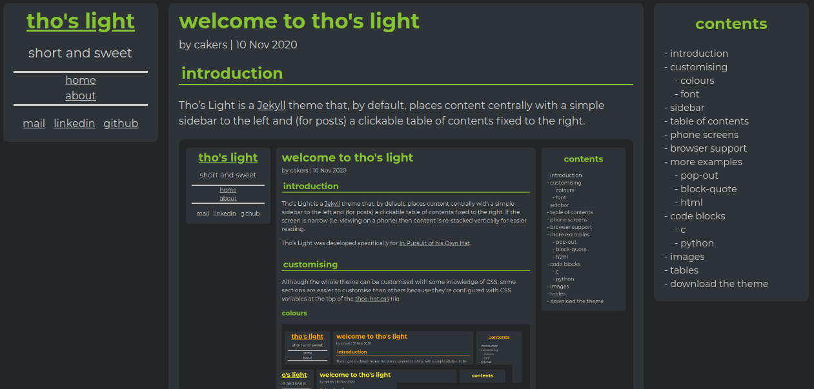
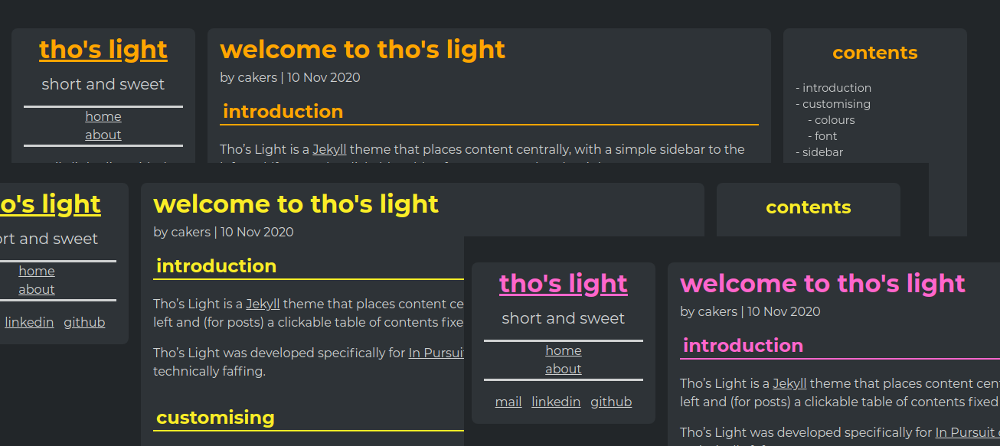
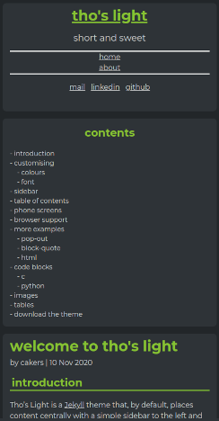

# tho's light

[NOTE: This Theme has been retired. I'll no longer be making any updates to it]

## introduction

Tho's Light is a [Jekyll](http://jekyllrb.com) theme that, by default, places content centrally with a simple sidebar to the left and (for posts) a navigable table of contents that scrolls down with the main panel.

Colours are set at the top of the CSS file using vars, so easy to redecorate.

For narrow screens content is re-stacked vertically for easier reading.

## github pages

Tho's Light is compatible with GitHub Pages, it only uses the pagination jekyll plugin.

## give it a go

To try it, simply clone the repo and run `jekll serve` to view locally.

You will need the jekyll-paginate plugin to be installed: `gem install jekyll-paginate`
